Instructions to app:

- git clone https://github.com/gogicha007/React2025Q1.git
- git checkout performance
- in order to mark visited country click on country card

React Tool Kit performance results:

Unoptimized code:
Trigger with Filter:
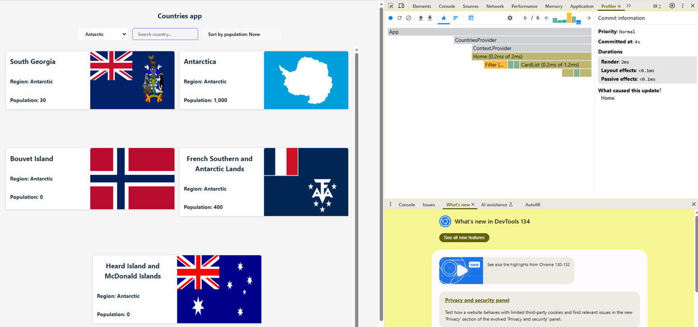
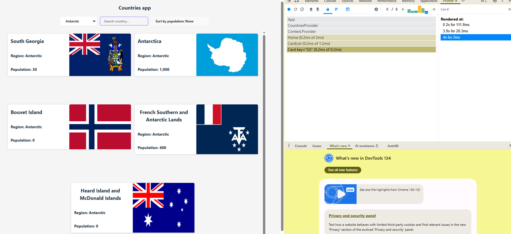
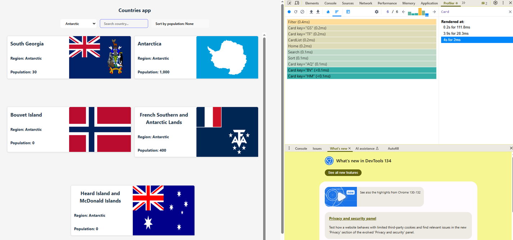
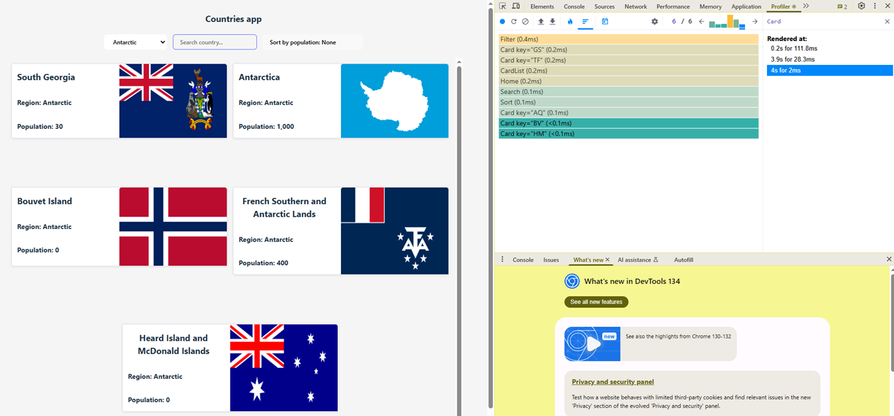

Trigger with Sorting:
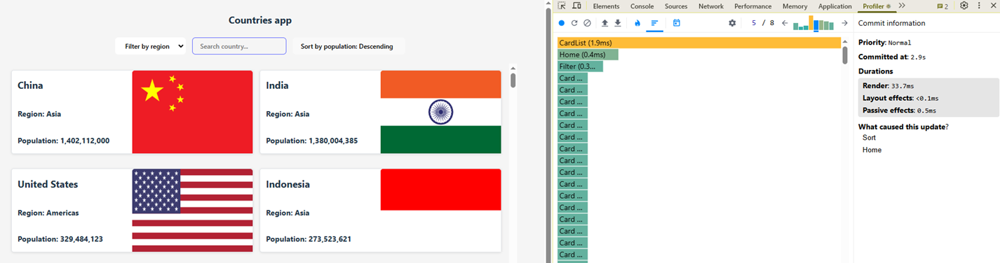
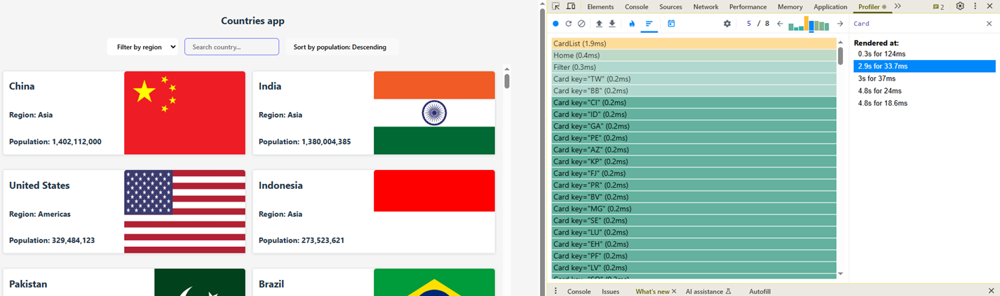
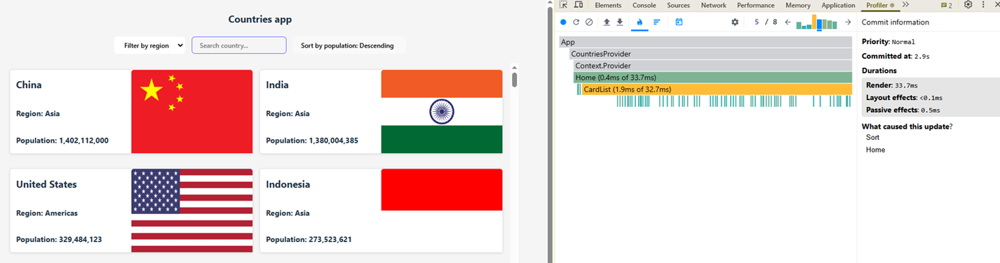

Optimized code:
Filter:
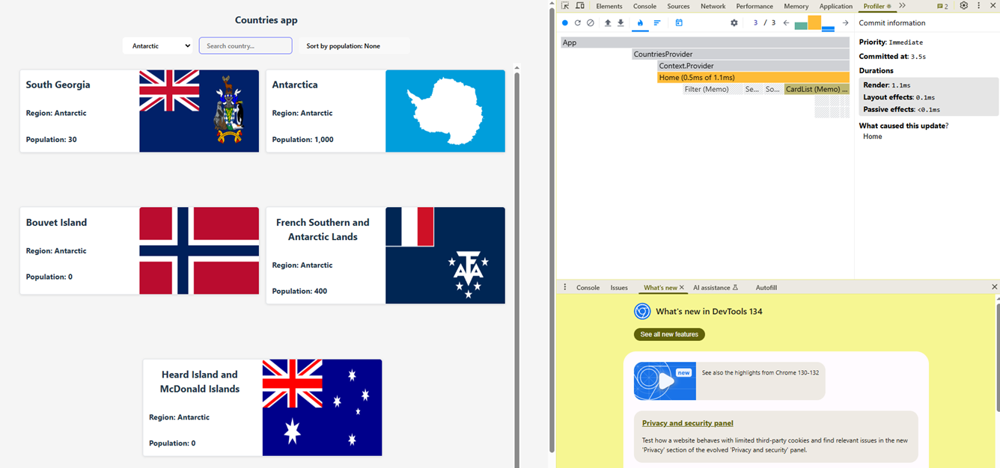
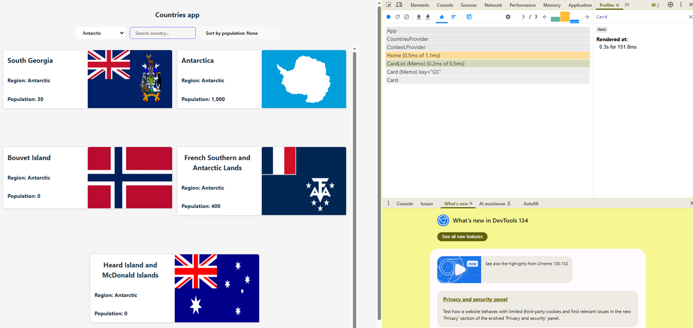

Sort:
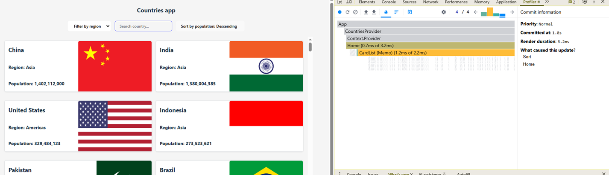
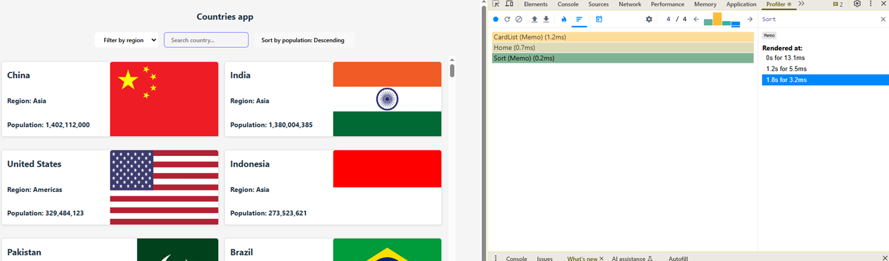
